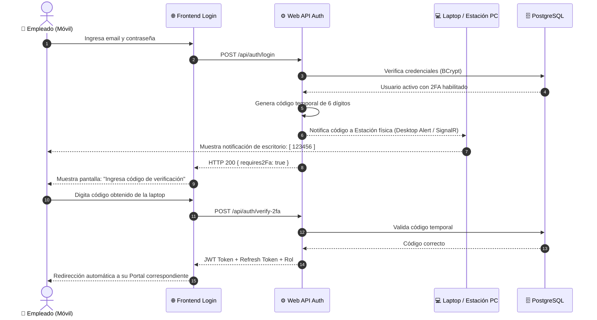
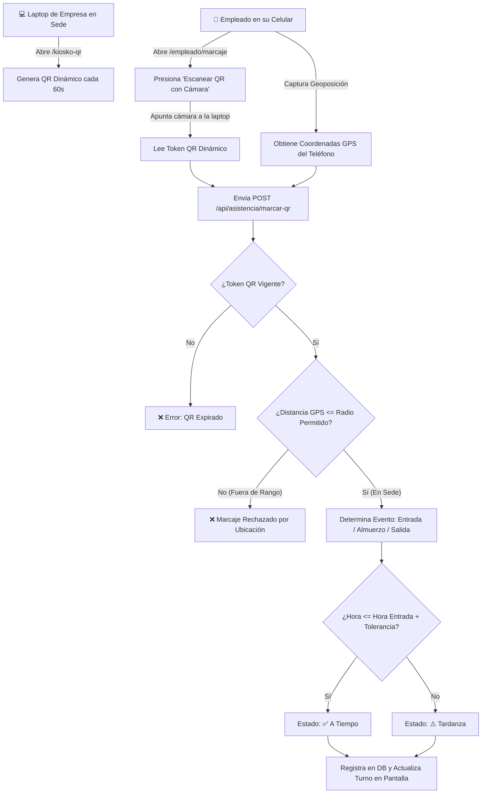
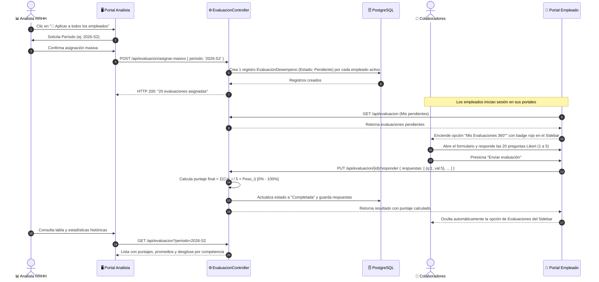
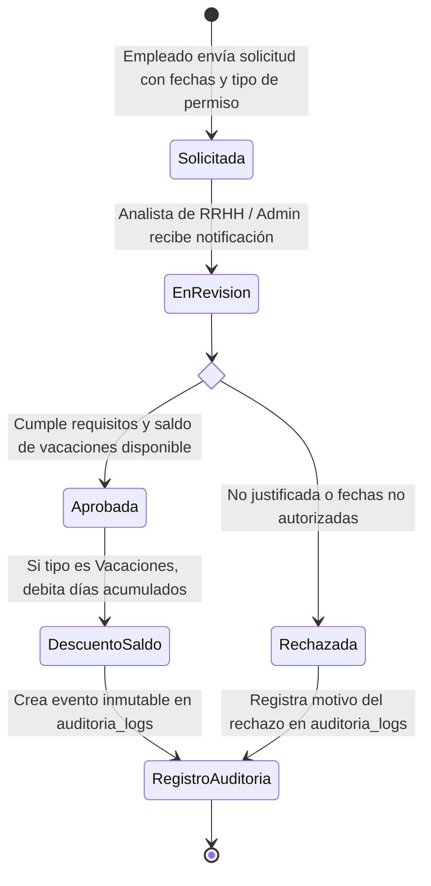
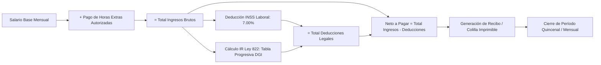

# 📖 Manual de Arquitectura, Flujos y Casos de Uso del Sistema

> **Proyecto:** Sistema Integral de Control de Asistencia, Evaluaciones 360° y Nómina para Mipymes  
> **Empresa Modelo:** Café & Tostaduría Rubí del Valle / Meseta Verde  
> **Versión:** 2.0 (Clean Architecture + CQRS + Multi-portal)

---

## 📑 Tabla de Contenidos
1. [Visión General y Roles del Sistema](#1-visión-general-y-roles-del-sistema)
2. [Arquitectura Tecnológica](#2-arquitectura-tecnológica)
3. [Casos de Uso Principales por Rol](#3-casos-de-uso-principales-por-rol)
4. [Diagramas de Flujo de Casos de Uso (Mermaid)](#4-diagramas-de-flujo-de-casos-de-uso-mermaid)
   - [4.1 Autenticación y Verificación 2FA en Estación de Trabajo](#41-autenticación-y-verificación-2fa-en-estación-de-trabajo)
   - [4.2 Marcaje de Asistencia: Kiosko QR en Pantalla + Celular con GPS](#42-marcaje-de-asistencia-kiosko-qr-en-pantalla--celular-con-gps)
   - [4.3 Ciclo Semestral de Evaluaciones 360° Ponderadas](#43-ciclo-semestral-de-evaluaciones-360-ponderadas)
   - [4.4 Gestión y Aprobación de Permisos y Vacaciones](#44-gestión-y-aprobación-de-permisos-y-vacaciones)
   - [4.5 Cálculo y Cierre de Nómina / Pre-Planilla (Ley 822)](#45-cálculo-y-cierre-de-nómina--pre-planilla-ley-822)
   - [4.6 Trazabilidad y Auditoría de Expedientes](#46-trazabilidad-y-auditoría-de-expedientes)
5. [Estructura de Base de Datos](#5-estructura-de-base-de-datos)
6. [Guía de Puesta en Marcha](#6-guía-de-puesta-en-marcha)

---

## 1. Visión General y Roles del Sistema

El sistema implementa una arquitectura multi-portal con **3 perfiles de usuario diferenciados**:

```
                  ┌─────────────────────────────────────┐
                  │          MipymeAsistencia           │
                  └──────────────────┬──────────────────┘
                                     │
         ┌───────────────────────────┼───────────────────────────┐
         ▼                           ▼                           ▼
┌──────────────────┐       ┌──────────────────┐        ┌──────────────────┐
│   👑 ADMIN       │       │  📊 ANALISTA RRHH│        │   👷 EMPLEADO    │
├──────────────────┤       ├──────────────────┤        ├──────────────────┤
│ • Gestión total  │       │ • Asigna Eval 360│        │ • Marcaje GPS/QR │
│ • Nómina / Cierre│       │ • Revisa Informes│        │ • Responde 360°  │
│ • Config Sede/GPS│       │ • Aprobaciones   │        │ • Solicita Perm  │
│ • Expedientes    │       │ • Pre-Planillas  │        │ • Recibo de pago │
└──────────────────┘       └──────────────────┘        └──────────────────┘
```

| Rol | Portal Base | Responsabilidades Clave |
|---|---|---|
| **👑 Administrador** | `/admin/dashboard` | Control total del sistema, configuración de sedes, cierre de períodos de nómina, gestión de usuarios y parámetros laborales. |
| **📊 Analista de RRHH** | `/analista/dashboard` | Aplicación masiva de evaluaciones 360° semestrales, revisión de asistencia, aprobación de solicitudes de permisos/vacaciones y generación de pre-planillas. |
| **👷 Empleado** | `/empleado/dashboard` | Marcaje de entrada/almuerzo/salida con QR y GPS, respuesta a evaluaciones 360° asignadas, registro de horas extras, solicitudes de vacaciones y consulta de recibos de pago. |

---

## 2. Arquitectura Tecnológica

### Backend (.NET 8 - Clean Architecture + CQRS)
- **MipymeAsistencia.Domain:** Entidades de negocio (`Empleado`, `EvaluacionDesempeno`, `HistorialAsistencia`, `HistorialPlanilla`, `AuditoriaLog`, etc.).
- **MipymeAsistencia.Application:** Casos de uso implementados con patrón CQRS (MediatR), validaciones con FluentValidation y DTOs tipados.
- **MipymeAsistencia.Infrastructure:** Persistencia con Entity Framework Core sobre PostgreSQL (Neon Cloud), servicios de almacenamiento con Supabase Storage y notificaciones SignalR.
- **MipymeAsistencia.WebApi:** Controladores RESTful documentados con Swagger OpenAPI, autenticación JWT Bearer e integración en tiempo real.

### Frontend (SPA Vanilla + Express Server)
- **Arquitectura Modular:** Componentes reutilizables, layouts dinámicos reactivos y gestión de sesión centralizada en `auth.js`.
- **Diseño Visual:** Sistema de diseño basado en CSS Custom Properties (`variables.css`), micro-interacciones fluidas y soporte responsivo móvil/escritorio.
- **Servidor Express (`server.js`):** Enrutador amigable que sirve las vistas estáticas y gestiona alias y redirecciones limpias.

---

## 3. Casos de Uso Principales por Rol

### Casos de Uso del Analista de Recursos Humanos
- **CU-RH-01 (Aplicar Evaluación Masiva):** Seleccionar un período semestral (ej. `2026-S2`) y generar automáticamente los 20 ítems ponderados para todos los colaboradores activos.
- **CU-RH-02 (Consultar Historial 360°):** Filtrar evaluaciones de semestres anteriores (`2025-S1`, `2025-S2`, `2026-S1`) y analizar el desglose pregunta a pregunta.
- **CU-RH-03 (Aprobación de Solicitudes):** Evaluar solicitudes de permisos y vacaciones con cálculo automático de días restantes.
- **CU-RH-04 (Pre-Planilla):** Previsualizar cálculos de INSS (7%), Impuesto sobre la Renta (Ley 822) y horas extras antes del cierre contable.

### Casos de Uso del Empleado
- **CU-EMP-01 (Marcaje con Kiosko QR):** Escanear el código dinámico de la laptop desde el celular validando radio GPS de tolerancia.
- **CU-EMP-02 (Responder Evaluación 360°):** Contestar las 20 preguntas en escala Likert (1 a 5). Al terminar, la opción se auto-oculta de su sidebar.
- **CU-EMP-03 (2FA de Estación):** Ingresar a su cuenta recibiendo el código de seguridad directamente en su computadora física asignada.
- **CU-EMP-04 (Descarga de Colilla de Pago):** Consultar desgloses de ingresos, deducciones de ley y salario neto.

---

## 4. Diagramas de Flujo de Casos de Uso (Mermaid)

### 4.1 Autenticación y Verificación 2FA en Estación de Trabajo



---

### 4.2 Marcaje de Asistencia: Kiosko QR en Pantalla + Celular con GPS



---

### 4.3 Ciclo Semestral de Evaluaciones 360° Ponderadas



---

### 4.4 Gestión y Aprobación de Permisos y Vacaciones



---

### 4.5 Cálculo y Cierre de Nómina / Pre-Planilla (Ley 822)



---

### 4.6 Trazabilidad y Auditoría de Expedientes

```mermaid
flowchart TD
    A[Acción Administrativa sobre Empleado] --> B{Tipo de Evento}
    B -->|Alta / Contratación| C[AuditoriaLog: Creación]
    B -->|Modificación Salarial| D[AuditoriaLog: Ajuste Salarial]
    B -->|Resolución de Permiso| E[AuditoriaLog: Permiso / Vacaciones]
    B -->|Resultado Desempeño| F[AuditoriaLog: Evaluación 360°]
    
    C & D & E & F --> G[(Tabla: auditoria_logs)]
    G --> H[Consulta GET /api/auditoria/empleado/{id}]
    H --> I[Timeline Visual en Expediente: Fecha + Usuario + Acción + Detalle]
```

---

## 5. Estructura de Base de Datos

El esquema relacional cuenta con tablas optimizadas con claves foráneas, índices y valores por defecto:

```
┌──────────────────────────┐        ┌──────────────────────────┐
│         usuarios         │1      *│  evaluaciones_desempeno  │
├──────────────────────────┤────────├──────────────────────────┤
│ id_usuario (PK)          │        │ id_evaluacion (PK)       │
│ email                    │        │ id_empleado (FK)         │
│ password_hash            │        │ id_evaluador (FK)        │
│ id_rol (FK) ──────────┐  │        │ periodo (ej: 2026-S2)    │
│ es_2fa_activo         │  │        │ perspectiva              │
└───────────────────────┼──┘        │ puntaje_final            │
                        │           │ estado (Pendiente/Comp)  │
                        │           └────────────┬─────────────┘
┌───────────────────────┼──┐                     │1
│         roles         │  │                     │*
├───────────────────────┤  │        ┌────────────┴─────────────┐
│ id_rol (PK)           │◄─┘        │  evaluacion_respuestas   │
│ nombre_rol            │           ├──────────────────────────┤
└───────────────────────┘           │ id_respuesta (PK)        │
                                    │ id_evaluacion (FK)       │
┌──────────────────────────┐        │ numero_pregunta (1-20)   │
│        empleados         │1      *│ calificacion (1-5)       │
├──────────────────────────┤────────┴──────────────────────────┘
│ id_empleado (PK)         │
│ id_usuario (FK)          │1      *┌──────────────────────────┐
│ nombres, apellidos       │────────│      auditoria_logs      │
│ cargo_funcion            │        ├──────────────────────────┤
│ salario_base_mensual     │        │ id_log (PK)              │
│ dias_vacaciones_acum     │        │ entidad, id_registro     │
└──────────────────────────┘        │ accion, usuario, fecha   │
                                    └──────────────────────────┘
```

---

## 6. Guía de Puesta en Marcha

### Prerrequisitos
- .NET 8.0 SDK
- Node.js (v18 o superior)
- PostgreSQL (o conexión a Neon Cloud incluida en `.env`)

### Ejecución Local

```bash
# 1. Iniciar servidor Frontend (Puerto 3000)
npm run frontend

# 2. Iniciar backend Web API (Puerto 5000 / Swagger)
cd backend/src/MipymeAsistencia.WebApi
dotnet run
```

### URLs de Acceso Rápido
- **Portal Principal / Login:** `http://localhost:3000/login`
- **Kiosko QR de Estación:** `http://localhost:3000/kiosko-qr`
- **Panel Admin:** `http://localhost:3000/admin/dashboard`
- **Panel Analista RRHH:** `http://localhost:3000/analista/dashboard`
- **Portal Empleado:** `http://localhost:3000/empleado/dashboard`
- **Documentación Swagger API:** `http://localhost:5000/swagger`
